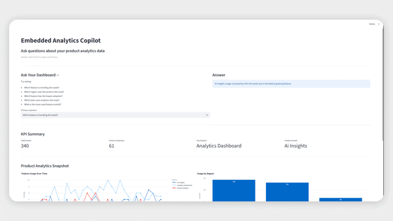
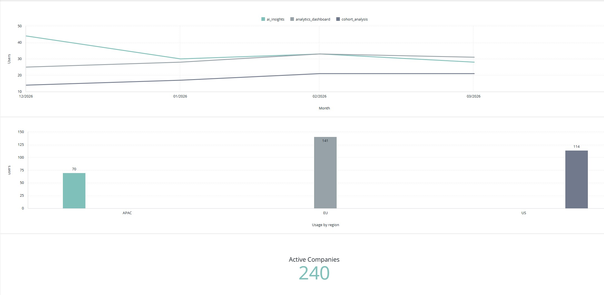

# Ask Your Dashboard
### Turning Sisense analytics into answer-driven product experiences

This prototype explores how SaaS teams can extend Sisense dashboards with an answer layer that lets users ask questions and receive direct insights from their analytics data.

Instead of asking users to interpret charts, the interface allows them to **ask questions about their product analytics and receive clear answers.**

The example use case focuses on **SaaS product usage analytics**, a common scenario for teams embedding Sisense analytics inside their products.

---

## Prototype Interface

The interface combines KPIs, analytics charts, and an answer layer that allows users to ask questions about their product analytics.

## Sisense Dashboard

Live Sisense dashboard used in the prototype:

https://signup-avb8ijal.sisense.com/app/main/dashboards/69d64ea21199e85765da9c3a

The dashboard above was created in the Sisense trial environment and serves as the analytics foundation for the prototype.
---

Example interaction:

User question  
> Which feature is trending this week?

System answer  
> AI Insights usage increased by 34% this week and is currently the fastest growing feature.

---

# Problem

Many SaaS companies embed analytics dashboards inside their products.

However, dashboards still require users to:
- inspect charts
- interpret trends
- figure out what changed

For many users this creates friction.

Developers want to move from:

**"Charts users must interpret"**

to:

**"Answers users can ask for."**

---

# Solution

This prototype demonstrates a lightweight pattern for **answer-driven product analytics**.

It combines:

- a traditional analytics dashboard
- computed insights
- a simple question → answer interface

This allows users to interact with analytics through **questions instead of chart interpretation**.

---

# Part 1 — Strategy

### 1. Who is the audience?

The primary audience is:

- SaaS developers
- technical product builders
- startup engineers embedding analytics into their applications

These teams often use Sisense to embed dashboards inside their products and want to make analytics easier for end users to understand.

---

### 2. Where should Sisense show this?

This concept would work well in developer-focused channels such as:

- Dev.to technical articles
- LinkedIn posts targeting product and engineering leaders
- Hacker News and Indie Hacker communities
- Sisense developer documentation and examples

The goal is to demonstrate how embedded analytics can evolve into **answer-driven product experiences**.

---

### 3. What is the Call To Action?

Developers can replicate this pattern by:

1. embedding Sisense dashboards in their product
2. exposing analytics data through the Sisense platform
3. adding a lightweight interaction layer that converts analytics into answers

CTA:

> Fork the repo and connect the prototype to your own Sisense dashboards.

This creates a **product-led growth loop** where developers explore new ways to build analytics-powered features.

---

# Prototype Overview

The prototype contains four main components.

### Ask the Dashboard

Users select a question about their analytics data and receive a clear answer.

Example questions:

- Which feature is trending this week?
- Which region uses the product the most?
- Which feature has the lowest adoption?
- Which plan uses analytics the most?

---

### KPI Summary

High-level metrics provide quick context:

- Total product events
- Active companies
- Most used feature
- Fastest growing feature

---

### Product Analytics Charts

Two charts provide supporting context:

- Feature usage over time
- Product usage by region

---

### Automated Insights

The system generates simple insights such as:

- fastest growing feature
- region with highest activity
- feature with lowest adoption

---

# Architecture

The prototype uses a lightweight architecture designed for rapid experimentation.

Sisense Dashboard
      │
      │ analytics data
      ▼
Streamlit Prototype
      │
      │ metrics + insights
      ▼
Answer Layer
(question → explanation)
---

# Components:

**Sisense**

Provides the analytics foundation through dashboards and embedded analytics capabilities.

**Python / Pandas**

Computes metrics such as:

- week-over-week growth
- feature adoption
- regional usage

**Streamlit**

Provides the interactive interface for exploring the concept quickly.

In a production environment the answers would be generated from **live Sisense analytics data rather than synthetic CSV data**.

---

# Example Dataset

The prototype uses a synthetic SaaS product usage dataset with events such as:

date
company_id
user_id
feature
event_type
plan
region

---

Example features:

- analytics_dashboard
- ai_insights
- cohort_analysis

Example events:

- view
- click
- run
- export

The dataset simulates **product telemetry commonly analyzed by SaaS teams.**

---

# Demo Flow

Typical interaction:

1. User opens the analytics interface
2. User selects a question
3. The system analyzes product usage data
4. The interface returns a concise answer

This pattern reduces the need to manually interpret dashboards.

---

# What This Prototype Demonstrates

This project explores three ideas:

**1. Answer-driven analytics**

Turning dashboards into interfaces that provide direct answers.

**2. Embedded analytics product patterns**

How SaaS teams can embed analytics experiences inside their products.

**3. Rapid builder workflows**

How developers can prototype analytics features quickly using simple tools.

---

# Why This Matters

Many embedded analytics experiences still rely on dashboards alone.

By adding a lightweight answer layer on top of analytics data, product teams can help users:

- understand changes faster
- reduce dashboard interpretation effort
- access insights through simple questions

---

## Project Files

- `generate_dataset.py` - creates a synthetic product usage dataset
- `data_prep.py` - computes KPIs, chart data, insights, and answers
- `app.py` - Streamlit app
- `product_usage.csv` - generated dataset
- `requirements.txt` - dependencies

---

# How To Run

1. Clone the repository: git clone https://github.com/cokobi/ask-your-dashboard
2. Install dependencies: pip install -r requirements.txt
3. Generate the dataset: python generate_dataset.py
4. Run the application: streamlit run app.py

---

# Possible Future Extensions

This prototype could evolve in several directions:

- Replace predefined questions with natural language queries
- Connect directly to live Sisense analytics data
- Use LLM routing to interpret open-ended questions
- Embed the interaction layer directly inside a SaaS product

---

# Summary

This prototype demonstrates how developers can transform dashboards into **answer-driven analytics experiences**.

By combining embedded analytics with lightweight interaction layers, product teams can make analytics more intuitive and accessible for end users.